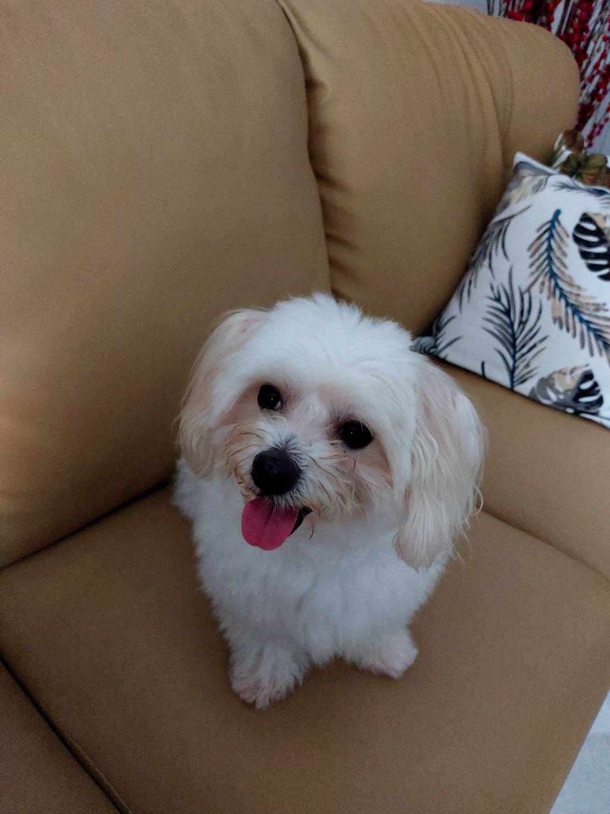

# **Hola Amigos** #

## **About Me** ##

My name is Ricky Cahyadi Halim Jo, I'm a 24 years old student from Indonesia, Jakarta. Currently I'm studying GMBA course in Tunghai University, Taiwan.

I'm an Experienced Graphic Designer with a demonstrated history of working in the consumer goods industry. Skilled in English, Brand Design, Adobe Photoshop, Vector, and Vector Illustration. Strong arts and design professional with a Bachelor of Design focused in Graphic Design from Universitas Multimedia Nusantara. 

## **My History** ##
I was born on June 24, 1998 in Jakarta, Indonesia, being the youngest in my family aside from my sister. Growing up, I went to several schools for my education in which I mostly have no problem settling in into the new environment. I took up natural science in high school, without knowing what I really want to become. Despite taking science major, throughout my high school years, I came to realize that Art & Design were my strong points. Hence, I took Graphic Design as my major of choice at the local college. 

During my college years, I’m actively involved in several professional working spaces. I’ve been appointed as a teaching assistant by my professor for Digital Media courses that involves creating motion graphic visuals. For graphic designer students, freelances are one of the most common sources of income. Fortunately, there were many start-up opportunities emerging around my campus area, in which I was contacted to design a brand image for a local coffee store. Things got interesting when I got my first professional paid internship as a fashion-oriented designer at Delami Garment Industries. As I have no experiences regarding fashion design before, I need to adjust and adapt in this new working environment with the hard skills that I’ve learned from beforehand.

After graduating from my college, I got accepted as a graphic designer for a marketing team at a company called BISFOODS INDONESIA which specialized in pets-related products. During my time working on professional ground, I’ve experienced that work is not all about hard skills. I’ve learned to engage more with my marketing team and customers, which piqued my interest not only in graphic design, but also business as a whole.

## **Experiences** ##
- **MJ Coffee & Tea**  
_*Sep 2018 - Dec 2018*_  
Art Director & Content Creator for coffee shop MJ Coffee & Tea

- **Delamibrands**  
_*Aug 2019 - Nov 2019*_  
Internship program at Delamibrands' Product Development division.

- **BISFOODS INDONESIA**    
_*Oct 2020 - Aug 2022*_    
Full time Graphic Designer for Pet related products

## **Hobbies** ##

My hobbies are mostly nature related activities, such as Hiking, Camping. Trekking, Snorkling, Diving, and many more.

----------------------------------------------

*Anyway here's a picture of my dog in case you guys are interested*

# __*CIAO*__ #

<!--
**rickycahyadi24/rickycahyadi24** is a ✨ _special_ ✨ repository because its `README.md` (this file) appears on your GitHub profile.

Here are some ideas to get you started:

- 🔭 I’m currently working on ...
- 🌱 I’m currently learning ...
- 👯 I’m looking to collaborate on ...
- 🤔 I’m looking for help with ...
- 💬 Ask me about ...
- 📫 How to reach me: ...
- 😄 Pronouns: ...
- ⚡ Fun fact: ...
-->
